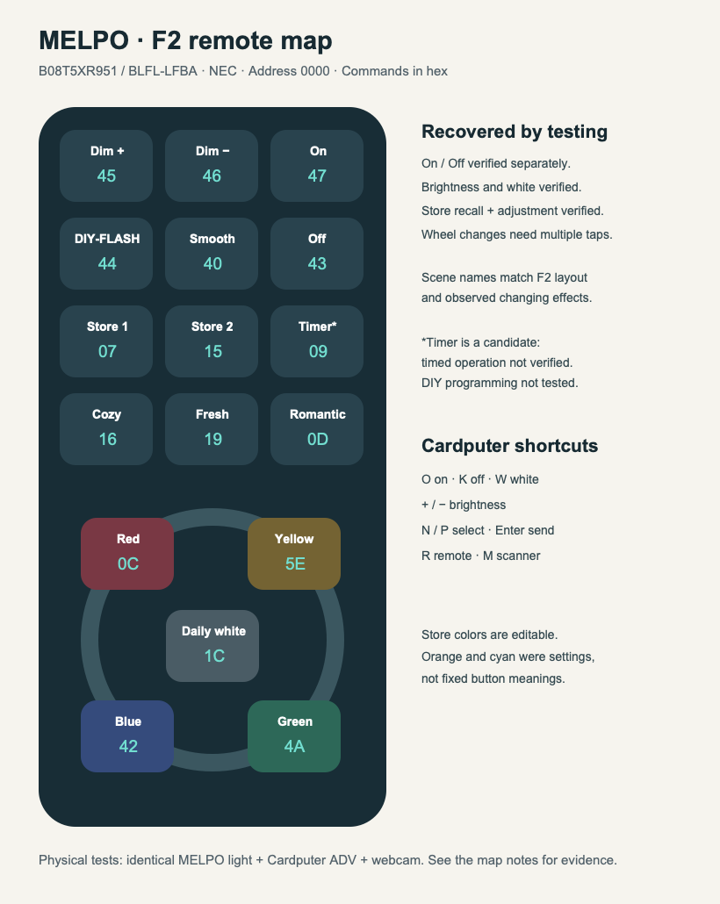

# MELPO F2-family floodlight IR codes

Device-tested IR commands for the **MELPO BLFL-LFBA / Amazon B08T5XR951**, a 50 W RGBW floodlight with 120 colors, 2700 K warm white, and an F2-style IR remote.

The original remote was missing. These commands were recovered by transmitting NEC candidates from a **Cardputer ADV**, observing a powered-on light through a webcam, and retesting useful responses. They are not copied generic RGB remote labels or direct captures of the missing remote.

**Protocol: NEC · Address: `0x0000` · Carrier: nominal 38 kHz**

```cpp
// Arduino-IRremote 4.7.1: address, command, repeat count
IrSender.sendNEC(0x0000, 0x47, 0); // On
IrSender.sendNEC(0x0000, 0x43, 0); // Off
IrSender.sendNEC(0x0000, 0x1C, 0); // Daily Lighting / white
```

## Downloads

- [Flipper remote: 16 controls](flipper/MELPO_BLFL-LFBA.ir) — Timer is deliberately excluded.
- [Command table: JSON](data/commands.json) / [CSV](data/commands.csv) — includes confidence, generated timings, and both full-value conventions.
- [Cardputer ADV firmware source](firmware/CardputerIRTester) — the named remote and original test interface.
- [Experimental Timer signal](experimental/MELPO_BLFL-LFBA_TIMER.ir) — duration and recurrence are unverified.
- [Testing method and limitations](docs/testing.md).

The Flipper file is a standards-based export of the tested NEC address/command pairs. It has been structurally validated, but **not tested on Flipper hardware**.

## Command map

All values are hexadecimal. The full-value column is **Arduino IRremote LSB-first storage**, not a legacy MSB-first constant.

| Control | Address | Command | Full value (LSB) | Evidence |
|---|---|---|---|---|
| On | `0000` | `47` | `0xB847FF00` | Confirmed |
| Off | `0000` | `43` | `0xBC43FF00` | Confirmed |
| Daily Lighting | `0000` | `1C` | `0xE31CFF00` | Confirmed |
| Dim Up | `0000` | `45` | `0xBA45FF00` | Confirmed |
| Dim Down | `0000` | `46` | `0xB946FF00` | Confirmed |
| Store 1 | `0000` | `07` | `0xF807FF00` | Confirmed recall and adjustment |
| Store 2 | `0000` | `15` | `0xEA15FF00` | Confirmed recall and adjustment |
| Red wheel | `0000` | `0C` | `0xF30CFF00` | Confirmed adjustment |
| Yellow wheel | `0000` | `5E` | `0xA15EFF00` | Confirmed adjustment; hue label from F2 layout |
| Blue wheel | `0000` | `42` | `0xBD42FF00` | Confirmed adjustment |
| Green wheel | `0000` | `4A` | `0xB54AFF00` | Confirmed adjustment |
| DIY-FLASH | `0000` | `44` | `0xBB44FF00` | Observed effect; label matched to F2 manual |
| Smooth | `0000` | `40` | `0xBF40FF00` | Observed effect; label matched to F2 manual |
| Cozy | `0000` | `16` | `0xE916FF00` | Observed effect; label matched to F2 manual |
| Fresh | `0000` | `19` | `0xE619FF00` | Observed effect; label matched to F2 manual |
| Romantic | `0000` | `0D` | `0xF20DFF00` | Observed effect; label matched to F2 manual |
| Timer | `0000` | `09` | `0xF609FF00` | Candidate; duration unverified |



## Important behavior

- **On and Off are separate controls**, not a toggle. Test power before concluding an otherwise unresponsive light uses different codes.
- **Store 1/2 recall editable colors.** Orange and cyan were the initial stored settings on the test unit; those are not permanent meanings of `07` and `15`. Both slots were changed and recalled during verification.
- **The wheel controls make fine adjustments.** A single press can be visually subtle; repeated taps produced obvious changes. They are not guaranteed one-tap pure-color selections.
- **Scene labels follow the F2 manual and observed effects.** Smooth traversed a broad color range; Cozy remained warm; Fresh changed through green/cyan; Romantic through purple/magenta. The original remote was not available to verify its transmitted packets.
- **Timer `09` remains a candidate.** An acknowledgement flash was observed, but hour-long shutoff, daily recurrence, and reset behavior were not verified. DIY-FLASH long-press programming and held-button repeat semantics are also untested.
- Camera exposure and white balance change automatically. This is a behavioral map, not calibrated color or brightness measurement.

## Compatibility

Physical testing covered the exact MELPO model/ASIN above. **F2-S remotes, other MELPO products, and HYDONG B08NV5RFMD are not confirmed compatible.** Similar labels or housings alone are not enough to claim a match. Bluetooth/BRMesh variants are outside this work.

The [F2 manual](https://www.roweevents.ca/wp-content/uploads/2022/01/RGB-light.pdf), pages 3–5, supplies layout and behavior descriptions. **It contains no numeric IR codes.** All code assignments here came from local device testing, with printed scene names inferred from layout and behavior.

## Cardputer

See [build instructions and keys](firmware/CardputerIRTester/README.md). The source uses the already-tested GPIO 44 transmitter. The separate `MelpoF2.h` table contains the recovered controls; retained generic scanner candidates are clearly separate and are **not** represented as F2 codes.

Upstream contribution: [Flipper-IRDB PR #1126](https://github.com/Lucaslhm/Flipper-IRDB/pull/1126).

## Validation and contributions

Run `python3 scripts/validate.py` to check encodings, exported signals, and the firmware table. See [CONTRIBUTING.md](CONTRIBUTING.md) for useful independent confirmations, especially Timer and long-press behavior.

## License and attribution

Published under **CC0-1.0**; see [LICENSE](LICENSE). The retained generic scanner data originates from [Flipper-IRDB](https://github.com/Lucaslhm/Flipper-IRDB/tree/d126fb1b6f1e114c52b4a8c19839ea65e3a9c24d), with its source list and license retained beside the firmware. That generic data was used during exploration; it is not the evidence for the recovered F2 map. External manuals and libraries retain their own licenses and are not bundled.
